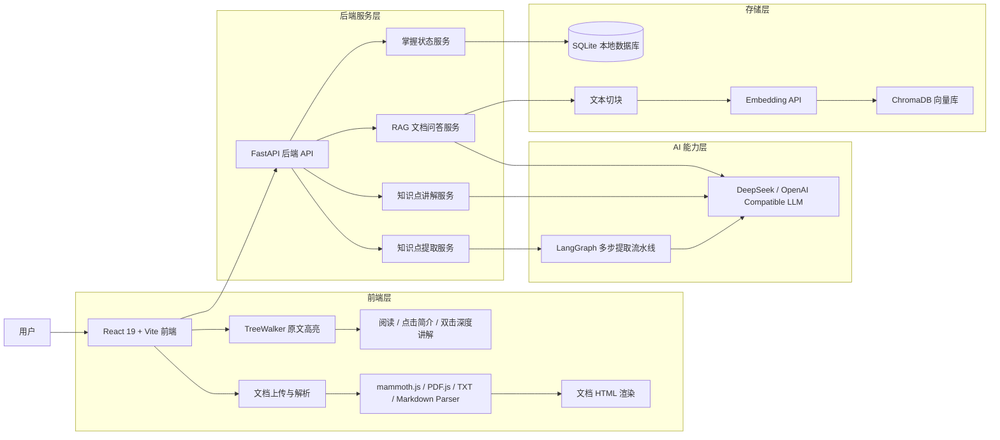
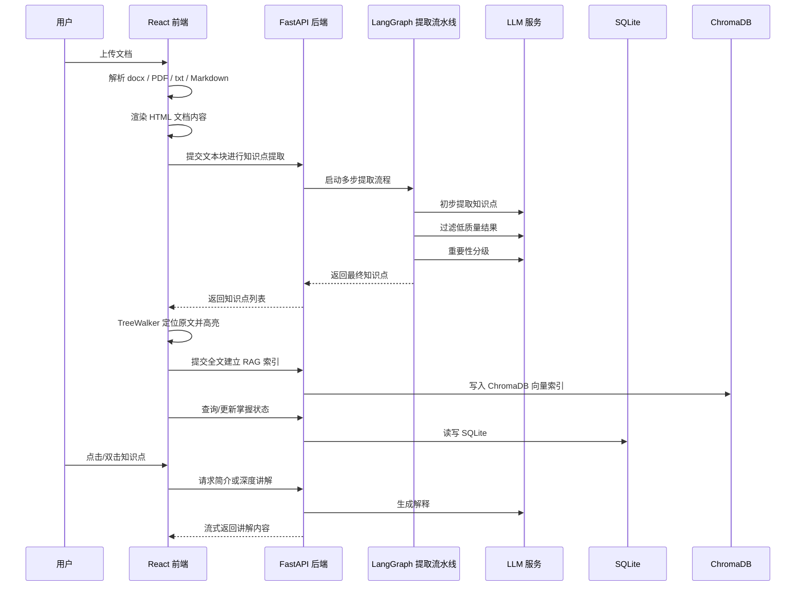

# AI 文档学习助手

> 一款面向通用文档阅读、知识整理和深度理解场景的 AI 文档学习工具，能从 docx、PDF、纯文本和 Markdown 文档中自动提取核心知识点，通过高亮 + 智能讲解帮助用户高效消化内容。

## ✨ 功能特性

- 📄 **多格式文档加载**：上传 docx、PDF、txt、Markdown 文档，前端实时解析渲染
- 🤖 **智能提取知识点**：通过 LLM 自动识别文档中的核心术语和公式
- 🎨 **原文高亮**：知识点在文档中以颜色标注，一目了然
- 💬 **单击看简介**：点击高亮立刻显示 2-3 句精简解释
- 📚 **双击深度讲解**：流式输出详细讲解，逐字呈现
- 🔎 **文档 RAG 问答**：围绕当前文档检索片段并生成回答
- 🧠 **知识掌握记录**：自动追踪理解进度，支持"已掌握"标记
- 👁️ **隐藏已掌握**：聚焦未掌握内容，避免重复打扰
- 💾 **跨文档持久化**：掌握记录保存在本地，多次使用不丢失

## 🛠️ 技术栈

### 前端
- **React 19** + **Vite**：开发框架与构建工具
- **mammoth.js + PDF.js**：docx 与 PDF 文档解析
- **TreeWalker API**：文本高亮的 DOM 操作
- **Fetch API + 流式读取**：对接 LLM 流式输出

### 后端
- **Python 3.10+** + **FastAPI**：Web 框架
- **SQLite**：用户知识掌握记录存储
- **DeepSeek API**：大语言模型服务
- **LangGraph + LangChain**：多步知识点提取流水线
- **Embedding RAG + ChromaDB**：当前文档向量检索与摘要记忆

## 🏗️ 系统架构

本项目采用前后端分离架构，前端负责文档解析、阅读交互和原文高亮，后端负责知识点提取、RAG 检索问答、LLM 调用和学习状态持久化。



### 架构说明

- **前端层**：基于 React 19 + Vite，负责文档上传、文档解析、HTML 渲染、原文高亮和用户交互。
- **后端服务层**：基于 FastAPI，提供知识点提取、知识点讲解、RAG 文档问答、学习状态管理等接口。
- **AI 能力层**：通过 LangGraph 将知识点提取拆分为多步流程，并统一调用 OpenAI-compatible LLM 服务。
- **存储层**：使用 ChromaDB 存储文档向量索引，使用 SQLite 保存知识点和掌握状态等轻量数据。

---

## 🔁 核心业务流程

下面展示用户从上传文档到知识点提取、RAG 建索引、点击知识点查看讲解的完整流程。



### 流程说明

1. 用户上传文档后，前端先在浏览器侧完成文档解析和 HTML 渲染。
2. 前端将文本内容提交给 FastAPI 后端，由 LangGraph 执行多步知识点提取。
3. 后端调用 LLM 完成初步提取、过滤和重要性分级，并返回最终知识点列表。
4. 前端使用 TreeWalker 在原文中定位知识点并进行高亮展示。
5. 后端将文档切块、生成 Embedding，并写入 ChromaDB，用于后续 RAG 文档问答。
6. 用户点击或双击知识点时，前端请求后端生成简介或深度讲解。
7. 用户的掌握状态通过 FastAPI 写入 SQLite，避免前端直接操作数据库。

## 🎬 Demo 演示

本 Demo 展示了从文档上传、知识点提取、原文高亮到 RAG 文档问答的完整流程。

https://github.com/user-attachments/assets/5fb9914e-ca63-4b83-ba4e-5a6e2969b06f

## 📦 项目结构

```text
ai-study-tool/
├── frontend/                       # React + Vite 前端应用
│   ├── public/                     # 静态资源
│   ├── src/
│   │   ├── main.jsx                # React 挂载入口
│   │   ├── app/
│   │   │   └── App.jsx             # 主界面编排：上传、阅读、讲解、问答
│   │   ├── api/                    # 后端 API 访问层
│   │   │   ├── client.js           # fetch 基础封装
│   │   │   ├── knowledge.js        # 知识点提取/掌握状态接口
│   │   │   ├── rag.js              # 文档索引与 RAG 问答接口
│   │   │   └── chat.js             # Agent/聊天接口
│   │   ├── features/               # 前端业务功能模块
│   │   │   ├── document/           # 文档解析、文本切块、内容规范化
│   │   │   ├── knowledge/          # 原文高亮与知识点定位
│   │   │   ├── explanation/        # 深度讲解面板与流式输出 Hook
│   │   │   ├── chat/               # 当前文档问答面板
│   │   │   └── layout/             # 顶部栏等布局组件
│   │   ├── styles/                 # 页面级样式
│   │   ├── types/                  # 前端常量与类型约定
│   │   ├── utils/                  # hash 等通用工具
│   │   └── assets/                 # 图片与前端资源
│   ├── package.json                # 前端依赖与 npm scripts
│   └── vite.config.js              # Vite 配置
├── backend/                        # FastAPI 后端服务
│   ├── main.py                     # uvicorn main:app 兼容入口
│   ├── requirements.txt            # Python 依赖
│   ├── app/
│   │   ├── main.py                 # FastAPI 创建、CORS、路由注册
│   │   ├── core/
│   │   │   ├── config.py           # 环境变量、API Key、CORS 配置
│   │   │   └── database.py         # SQLite 初始化与连接
│   │   ├── routers/                # HTTP API 路由
│   │   │   ├── health.py           # 健康检查与 LLM 连通性测试
│   │   │   ├── extract.py          # 知识点提取接口
│   │   │   ├── explain.py          # 深度讲解流式接口
│   │   │   ├── knowledge.py        # 点击、掌握状态、统计接口
│   │   │   ├── rag.py              # 文档索引与检索问答接口
│   │   │   └── agent.py            # 学习 Agent 对话接口
│   │   ├── services/               # 核心业务服务
│   │   │   ├── llm_service.py      # DeepSeek/OpenAI 兼容调用
│   │   │   ├── extract_service.py  # 知识点提取流水线入口
│   │   │   ├── explain_service.py  # 简介与深度讲解生成
│   │   │   ├── knowledge_service.py # 掌握状态读写
│   │   │   └── rag_service.py      # ChromaDB 向量索引与检索
│   │   ├── agents/                 # LangGraph 学习 Agent
│   │   ├── schemas/                # Pydantic 请求/响应模型
│   │   └── models/                 # 领域常量与数据模型
│   ├── chroma_store/               # ChromaDB 本地向量库（运行生成）
│   ├── user_data.db                # SQLite 本地数据（运行生成）
│   ├── .env                        # 本地密钥配置（不提交）
│   └── venv/                       # Python 虚拟环境（不提交）
├── test-docs/                      # 本地测试文档样例
├── .gitignore
└── README.md
```

> 说明：`venv/`、`.env`、`user_data.db`、`chroma_store/`、`__pycache__/` 等均为本地运行产物或敏感配置，应保持在 `.gitignore` 中，不作为源码提交。

## 🚀 快速开始

### 前置要求

- Node.js ≥ 18
- Python ≥ 3.10
- DeepSeek API Key（[去注册](https://platform.deepseek.com)）

### Docker Compose 一键启动

如果你本机已安装 Docker，可以不单独配置 Node.js / Python 环境，直接用 Docker Compose 启动前后端：

```bash
cp .env.example .env
```

编辑项目根目录的 `.env`，填入你的 `DEEPSEEK_API_KEY`：

```env
DEEPSEEK_API_KEY=你的_DeepSeek_API_Key
DEEPSEEK_BASE_URL=https://api.deepseek.com

# 可选：启用 RAG 向量检索。未配置时自动回退关键词检索
EMBEDDING_API_KEY=
EMBEDDING_BASE_URL=https://api.openai.com/v1
EMBEDDING_MODEL=text-embedding-3-small

FRONTEND_PORT=80
ALLOWED_ORIGINS=http://localhost
UVICORN_WORKERS=1
```

#### 生产模式

生产模式只使用 `docker-compose.yml`，前端由 nginx 提供静态文件并反向代理 `/api/*` 到后端容器：

```bash
docker compose -f docker-compose.yml up -d --build
```

启动完成后访问：

- 应用入口：http://localhost
- 健康检查：http://localhost/api/health

容器启动时会自动运行：

- 后端：`uvicorn main:app --host 0.0.0.0 --port 8000 --workers ${UVICORN_WORKERS:-1}`
- 前端：nginx 静态服务 + `/api/` 反向代理

SQLite 数据库和 ChromaDB 向量库会持久化到 Docker volume `ai-study-tool_backend-data`。查看日志：

```bash
docker compose -f docker-compose.yml logs -f
```

停止并保留数据：

```bash
docker compose -f docker-compose.yml down
```

如果要连同 Docker volume 中的数据一起清空：

```bash
docker compose -f docker-compose.yml down -v
```

#### 开发模式

直接运行 `docker compose up --build` 时，Docker Compose 会自动合并 `docker-compose.override.yml`，进入开发模式：

```bash
docker compose up --build
```

- 前端：http://localhost:5173
- 后端 API：http://localhost:8000
- 接口文档：http://localhost:8000/docs
- 后端使用 `--reload`
- 前端使用 Vite dev server，并通过 Vite proxy 转发 `/api/*`

### 1. 克隆/进入项目

```bash
cd /path/to/ai-study-tool
```

### 2. 配置后端

```bash
cd backend

# 创建虚拟环境
python3 -m venv venv
source venv/bin/activate  # Mac/Linux
# venv\Scripts\activate   # Windows

# 安装依赖
pip install -r requirements.txt
```

在 `backend/` 目录下创建 `.env` 文件：

```
DEEPSEEK_API_KEY=你的_DeepSeek_API_Key
DEEPSEEK_BASE_URL=https://api.deepseek.com

# 可选：启用 RAG 向量检索。未配置时自动回退关键词检索
EMBEDDING_API_KEY=你的_Embedding_API_Key
EMBEDDING_BASE_URL=https://api.openai.com/v1
EMBEDDING_MODEL=text-embedding-3-small
```

启动后端：

```bash
uvicorn main:app --reload --port 8000
```

后端运行在 http://localhost:8000

### 3. 配置前端

打开新终端：

```bash
cd frontend
npm install
npm run dev
```

前端运行在 http://localhost:5173

### 4. 开始使用

浏览器访问 http://localhost:5173 → 上传一份 docx、PDF、txt 或 Markdown 文档 → 等待知识点提取完成 → 开始阅读与整理

## 📖 使用指南

### 基础交互

| 操作 | 效果 |
|------|------|
| 单击文档高亮 | 右侧显示 2-3 句简介 |
| 双击文档高亮 | 右侧流式生成详细讲解 |
| 单击右侧卡片 | 滚动到文档中对应位置 |
| 双击右侧卡片 | 直接触发详细讲解 |
| 点"标记已掌握" | 该知识点变绿+删除线，不再打扰 |
| 切换"隐藏已掌握" | 已掌握的不显示高亮 |

### 高亮颜色含义

- 🟡 **黄色**：术语（未掌握）
- 🟠 **橙色**：公式（未掌握）
- 🟡 **浅黄/浅橙**：理解中（已点击 ≥ 3 次）
- 🟢 **绿色 + 删除线**：已掌握

## 🔌 主要 API

| 路径 | 方法 | 用途 |
|------|------|------|
| `/api/extract-knowledge` | POST | 从文本块中提取知识点 |
| `/api/rag/index` | POST | 接收完整文本并建立 RAG chunk 索引 |
| `/api/rag/query` | POST | 检索当前文档并生成问答 |
| `/api/agent/chat` | POST | 调用学习 Agent 进行对话 |
| `/api/agent/tools` | GET | 查看 Agent 可用工具 |
| `/api/explain-deep` | POST | 流式生成深度讲解 |
| `/api/knowledge/click` | POST | 上报知识点点击 |
| `/api/knowledge/mark-known` | POST | 标记为已掌握 |
| `/api/knowledge/unmark-known` | POST | 取消已掌握 |
| `/api/knowledge/status-batch` | POST | 批量查询掌握状态 |
| `/api/knowledge/stats` | GET | 掌握情况统计 |
| `/api/knowledge/reset` | POST | 重置所有掌握记录 |

完整的接口文档可访问 http://localhost:8000/docs（FastAPI 自动生成的 Swagger UI）。

## 💡 工作原理

### 知识点提取流程

```
用户上传文档
   ↓
前端解析为 HTML
   ↓
按段落切分成文本块(每块约 800 字)
   ↓
LangGraph 三步流水线：召回提取 → 质量过滤 → 重要性分级
   ↓
前端用 TreeWalker API 在原文中精确定位并包裹 <mark> 标签
   ↓
绑定单击/双击事件
```

### 掌握状态机

```
unknown(未掌握,默认)
   ↓ 点击 ≥ 3 次
learning(理解中)
   ↓ 用户点"标记已掌握"
known(已掌握)
   ↓ 用户点"取消"
回到 unknown 或 learning
```

## 🎯 设计取舍

- **同名知识点全局共享**：基于 `kp_text` 文本作为唯一键，跨文档同步掌握状态
- **同一文档同名只高亮一次**：避免视觉污染
- **缓存提取结果**：相同文本块不重复调 LLM，节省成本
- **流式输出**：双击触发的详细讲解逐字呈现，提升体验
- **本地优先**：所有数据存在本地 SQLite，无需注册账号

## 💰 成本估算

使用 DeepSeek API（约 ¥1/百万 tokens）：

- 一份 20 页文档：提取约 ¥0.05-0.10
- 一次详细讲解：约 ¥0.005
- 月成本：轻度使用 ¥10 以内

## 🚧 已知限制

- docx 中的复杂公式（OOXML MathML）暂未渲染，公式以原始文本形式显示
- PDF 当前以文本提取为主，扫描版 PDF 需要先 OCR 后再使用
- 知识点提取质量依赖 LLM，偶有遗漏或误判
- 单用户使用，未做账号体系

## 🛣️ 后续规划

- [ ] KaTeX 集成，支持数学公式渲染
- [ ] 知识笔记导出（Markdown）
- [ ] 知识点之间的关联推荐
- [ ] 回看提醒（间隔重复算法）
- [ ] 多文档管理面板
- [ ] PDF OCR 与复杂版式支持

## 📝 开发说明

### 启动开发环境

```bash
# 终端 1: 后端
cd backend
source venv/bin/activate
uvicorn main:app --reload --port 8000

# 终端 2: 前端
cd frontend
npm run dev
```

### 重置掌握数据

```bash
# 方法 1: 删除数据库文件
rm backend/user_data.db
# 重启后端会自动重建

# 方法 2: 调接口
curl -X POST http://localhost:8000/api/knowledge/reset
```

### 调试技巧

- 浏览器控制台查看知识点提取/匹配日志
- 后端终端查看 LLM 请求与响应
- 访问 http://localhost:8000/docs 直接测试 API

## 📄 License

仅供个人学习与研究使用。

## 🙏 致谢

- 模型服务：[DeepSeek](https://platform.deepseek.com)
- docx 解析：[mammoth.js](https://github.com/mwilliamson/mammoth.js)
- Web 框架：[FastAPI](https://fastapi.tiangolo.com) + [Vite](https://vitejs.dev) + [React](https://react.dev)

---

由 AI 辅助开发，作为 MVP 文档学习项目。
