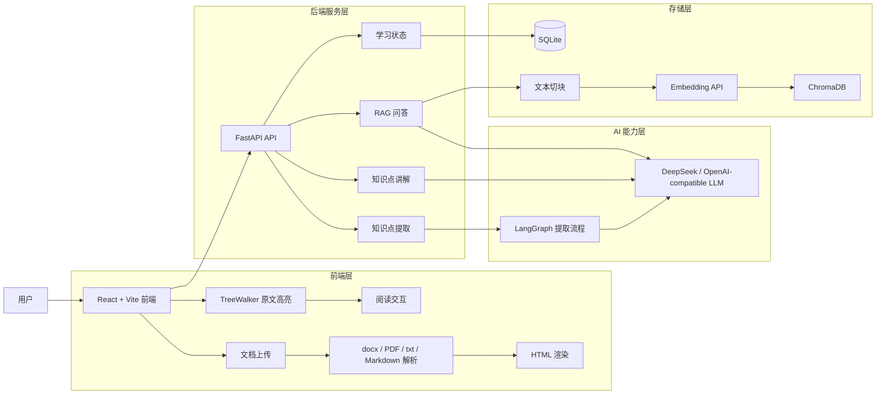

# AI 文档学习助手

AI 文档学习助手是一款面向文档阅读、知识整理和深度理解的本地优先学习工具。它可以解析 docx、PDF、txt 和 Markdown 文档，自动提取核心知识点，在原文中高亮展示，并通过简介、深度讲解和当前文档问答帮助用户更快消化内容。

Demo:

https://github.com/user-attachments/assets/5fb9914e-ca63-4b83-ba4e-5a6e2969b06f

## 核心能力

- 多格式文档解析：支持 docx、PDF、txt、Markdown，浏览器侧完成解析和渲染。
- AI 知识点提取：调用 OpenAI-compatible LLM，自动识别术语、公式和重点概念。
- 原文精准高亮：通过 TreeWalker 在文档 DOM 中定位知识点，并保持阅读上下文。
- 单击简介、双击深讲：单击查看 2-3 句解释，双击流式生成更完整的讲解。
- 当前文档 RAG 问答：为上传文档建立索引，围绕原文片段进行检索增强回答。
- 学习状态记录：点击次数、理解中、已掌握等状态持久化到本地 SQLite。
- 隐藏已掌握内容：过滤已经掌握的知识点，聚焦还需要复习的内容。

## 技术栈

| 层级 | 技术 |
| --- | --- |
| 前端 | React 19, Vite, mammoth.js, PDF.js, Fetch streaming |
| 后端 | Python 3.10+, FastAPI, Pydantic, SQLite |
| AI 编排 | DeepSeek/OpenAI-compatible API, LangGraph, LangChain |
| 检索存储 | ChromaDB, Embedding API, 关键词检索兜底 |
| 部署 | Docker Compose, nginx, GitHub Actions, GHCR |

## 快速开始

推荐优先使用 Docker Compose，配置最少，也和生产部署形态最接近。

### 1. 准备环境变量

```bash
cp .env.example .env
```

编辑项目根目录的 `.env`：

```env
DEEPSEEK_API_KEY=你的_DeepSeek_API_Key
DEEPSEEK_BASE_URL=https://api.deepseek.com

# 可选。留空时 RAG 会自动回退到关键词检索。
EMBEDDING_API_KEY=
EMBEDDING_BASE_URL=https://api.openai.com/v1
EMBEDDING_MODEL=text-embedding-3-small

# Docker 生产模式前端端口。
FRONTEND_PORT=80

# 允许访问后端的前端来源。
ALLOWED_ORIGINS=http://localhost

# 本项目内置 SQLite + 本地 ChromaDB，建议保持 1。
UVICORN_WORKERS=1
```

### 2. Docker 一键启动

生产模式使用 nginx 提供前端静态资源，并把 `/api/*` 反向代理到后端：

```bash
docker compose -f docker-compose.yml up -d --build
```

启动后访问：

- 应用入口：http://localhost
- 健康检查：http://localhost/api/health

查看日志：

```bash
docker compose -f docker-compose.yml logs -f
```

停止服务但保留数据：

```bash
docker compose -f docker-compose.yml down
```

清空容器和持久化数据：

```bash
docker compose -f docker-compose.yml down -v
```

### 3. Docker 开发模式

直接运行 `docker compose up --build` 时，Compose 会自动合并 `docker-compose.override.yml`，进入开发模式：

```bash
docker compose up --build
```

- 前端：http://localhost:5173
- 后端 API：http://localhost:8000
- Swagger 文档：http://localhost:8000/docs
- 前端使用 Vite dev server，并通过 proxy 转发 `/api/*`
- 后端使用 `uvicorn --reload`

## 本地开发

如果你希望直接在本机运行前后端，可按下面方式启动。

### 后端

```bash
cd backend
python3 -m venv venv
source venv/bin/activate
pip install -r requirements.txt
uvicorn main:app --reload --port 8000
```

后端默认读取 `backend/.env`。如果使用本地启动，也可以在 `backend/` 下创建同样的配置：

```env
DEEPSEEK_API_KEY=你的_DeepSeek_API_Key
DEEPSEEK_BASE_URL=https://api.deepseek.com
EMBEDDING_API_KEY=
EMBEDDING_BASE_URL=https://api.openai.com/v1
EMBEDDING_MODEL=text-embedding-3-small
```

### 前端

```bash
cd frontend
npm install
npm run dev
```

前端默认运行在 http://localhost:5173，并把 API 请求代理到 http://localhost:8000。也可以通过 `VITE_API_BASE` 指定完整 API 地址。

## 使用方式

1. 打开应用并上传 docx、PDF、txt 或 Markdown 文档。
2. 等待前端解析文档，后端提取知识点并建立当前文档索引。
3. 在正文中查看高亮知识点，或在右侧列表浏览重点内容。
4. 单击高亮查看简介，双击高亮触发流式深度讲解。
5. 在问答面板中围绕当前文档提问。
6. 将已经理解的内容标记为“已掌握”，之后可隐藏这些高亮。

### 交互说明

| 操作 | 效果 |
| --- | --- |
| 单击正文高亮 | 显示简短解释 |
| 双击正文高亮 | 流式生成深度讲解 |
| 单击右侧知识点卡片 | 滚动到正文对应位置 |
| 双击右侧知识点卡片 | 直接触发深度讲解 |
| 标记已掌握 | 知识点变为已掌握状态 |
| 隐藏已掌握 | 只展示尚未掌握或理解中的知识点 |

### 高亮状态

| 状态 | 含义 |
| --- | --- |
| 黄色 | 术语，未掌握 |
| 橙色 | 公式，未掌握 |
| 浅色 | 理解中，通常表示已多次点击 |
| 绿色 + 删除线 | 已掌握 |

## 系统架构



核心流程：

1. 前端在浏览器中解析并渲染文档。
2. 前端将文本切块后提交给后端。
3. 后端通过 LangGraph 调用 LLM 完成提取、过滤和重要性分级。
4. 前端把返回的知识点定位到原文并高亮。
5. 后端为当前文档建立 ChromaDB 向量索引；未配置 embedding 时自动使用关键词检索。
6. 用户点击、标记和问答产生的学习状态写入 SQLite。

## 项目结构

```text
ai-study-tool/
├── backend/                    # FastAPI 后端服务
│   ├── app/
│   │   ├── agents/             # LangGraph 学习 Agent
│   │   ├── core/               # 配置、数据库初始化
│   │   ├── routers/            # HTTP API 路由
│   │   ├── schemas/            # Pydantic 请求/响应模型
│   │   └── services/           # LLM、提取、讲解、RAG、掌握状态服务
│   ├── main.py                 # uvicorn main:app 入口
│   └── requirements.txt
├── frontend/                   # React + Vite 前端应用
│   ├── src/
│   │   ├── api/                # 后端 API 封装
│   │   ├── app/                # 应用入口与状态编排
│   │   ├── features/           # 文档、知识点、讲解、问答等功能模块
│   │   ├── styles/             # 页面样式
│   │   ├── types/              # 常量与类型约定
│   │   └── utils/              # 通用工具
│   ├── package.json
│   └── vite.config.js
├── test-docs/                  # 测试文档样例
├── docker-compose.yml          # 生产模式 Compose
├── docker-compose.override.yml # 开发模式 Compose 覆盖
├── docker-compose.deploy.yml   # 服务器部署 Compose
├── .env.example                # 环境变量模板
└── README.md
```

运行时生成的数据默认不会提交：

- `backend/user_data.db`：SQLite 学习状态
- `backend/chroma_store/`：ChromaDB 向量库
- `backend/.env`、根目录 `.env`：本地密钥配置
- `backend/venv/`、`node_modules/`、`__pycache__/`：本地依赖或缓存

## 主要 API

| 路径 | 方法 | 用途 |
| --- | --- | --- |
| `/api/health` | GET | 健康检查 |
| `/api/test-llm` | POST | 测试 LLM 连通性 |
| `/api/extract-knowledge` | POST | 从文本块提取知识点 |
| `/api/extract-knowledge-batch` | POST | 批量提取知识点 |
| `/api/explain-deep` | POST | 流式生成深度讲解 |
| `/api/rag/index` | POST | 为当前文档建立索引 |
| `/api/rag/query` | POST | 当前文档检索问答 |
| `/api/agent/chat` | POST | 学习 Agent 对话 |
| `/api/agent/tools` | GET | 查看 Agent 工具 |
| `/api/knowledge/click` | POST | 上报知识点点击 |
| `/api/knowledge/mark-known` | POST | 标记已掌握 |
| `/api/knowledge/unmark-known` | POST | 取消已掌握 |
| `/api/knowledge/status-batch` | POST | 批量查询掌握状态 |
| `/api/knowledge/stats` | GET | 查看掌握统计 |
| `/api/knowledge/reset` | POST | 重置掌握记录 |

完整接口文档见 http://localhost:8000/docs。

## 常用维护命令

前端检查：

```bash
cd frontend
npm run lint
npm run build
```

重置学习数据：

```bash
curl -X POST http://localhost:8000/api/knowledge/reset
```

或停止服务后删除本地数据库文件：

```bash
rm backend/user_data.db
```

查看容器状态：

```bash
docker compose ps
```

## CI/CD 与部署

项目内置 GitHub Actions 工作流：

- `.github/workflows/ci.yml`：PR 或 push 到主分支时，检查前端安装、lint、build，并校验生产 Compose 可构建。
- `.github/workflows/container-publish.yml`：push 到 `main` 或 `v*` tag 时构建前后端镜像，并发布到 GitHub Container Registry。
- `.github/workflows/deploy.yml`：镜像发布后或手动触发时，通过 SSH 登录服务器并滚动更新容器。

默认镜像：

```text
ghcr.io/54dongdaozhu/pagemind-backend:latest
ghcr.io/54dongdaozhu/pagemind-frontend:latest
```

启用自动部署需要在 GitHub Actions secrets/variables 中配置：

```text
DEPLOY_HOST
DEPLOY_USER
DEPLOY_SSH_KEY
DEPLOY_PATH
DEPLOY_PORT

DEEPSEEK_API_KEY
DEEPSEEK_BASE_URL
EMBEDDING_API_KEY
EMBEDDING_BASE_URL
EMBEDDING_MODEL
ALLOWED_ORIGINS
FRONTEND_PORT
UVICORN_WORKERS

GHCR_USERNAME
GHCR_TOKEN
```

服务器首次准备：

```bash
sudo mkdir -p /opt/pagemind
sudo chown "$USER":"$USER" /opt/pagemind
docker login ghcr.io
```

如果 SSH 部署配置不完整，部署 workflow 会跳过服务器更新，但仍可保留镜像构建与发布结果。

## 设计取舍

- 本地优先：学习状态和向量索引默认保存在本地，适合单用户学习场景。
- LLM 可替换：后端使用 OpenAI-compatible 调用方式，默认配置 DeepSeek。
- RAG 可降级：未配置 embedding 时，文档问答回退到关键词检索。
- 同名知识点共享状态：基于知识点文本记录掌握状态，便于跨文档复用。
- 同一文档同名只高亮一次：降低重复高亮带来的阅读干扰。

## 已知限制

- 扫描版 PDF 需要先 OCR，当前主要处理可提取文本的 PDF。
- docx 中复杂公式暂未完整渲染，可能以普通文本形式展示。
- 知识点质量依赖 LLM，可能出现遗漏、误判或粒度不一致。
- 当前以单用户本地学习为主，暂未提供账号体系和多人协作能力。

## 路线图

- [ ] 支持 KaTeX 公式渲染
- [ ] 导出知识笔记到 Markdown
- [ ] 增加知识点关联推荐
- [ ] 加入间隔重复复习提醒
- [ ] 提供多文档管理面板
- [ ] 支持 PDF OCR 和复杂版式解析

## License

MIT
